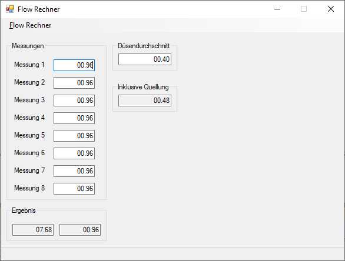

# Flow Calculator

Einfacher Flow Rechner (als Windows Forms Anwendung in Microsoft .NET Framework 4.7.1)
für den 3D Druck by Denise Winkelmann.

Siehe auch:

- https://www.thingiverse.com/thing:4485630
- https://printed-parts.eu/Downloads/kostenlose-downloads/Flow-Rechner.html

---

## Screenshot

---

## Todo

*TBD*

---

## Links

- [Printed Parts](https://printed-parts.eu/Downloads/kostenlose-downloads/Flow-Rechner.html)
- [MakerBot Thingiverse](https://www.thingiverse.com/thing:4485630)
- [Youtube](https://youtu.be/J8RksRFIHp4)
- [Testwürfel](https://www.thingiverse.com/thing:3342293)

